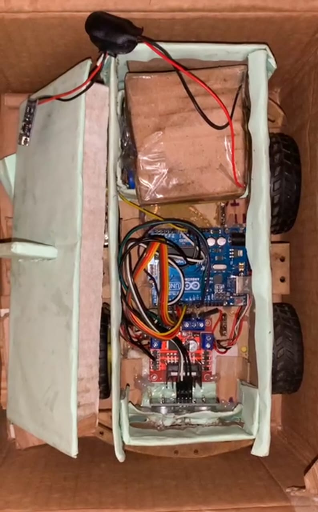
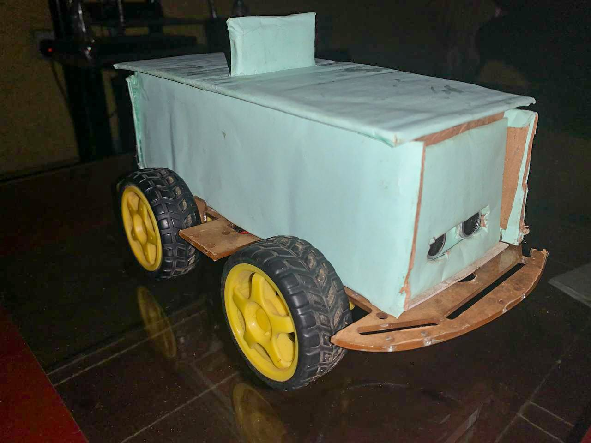
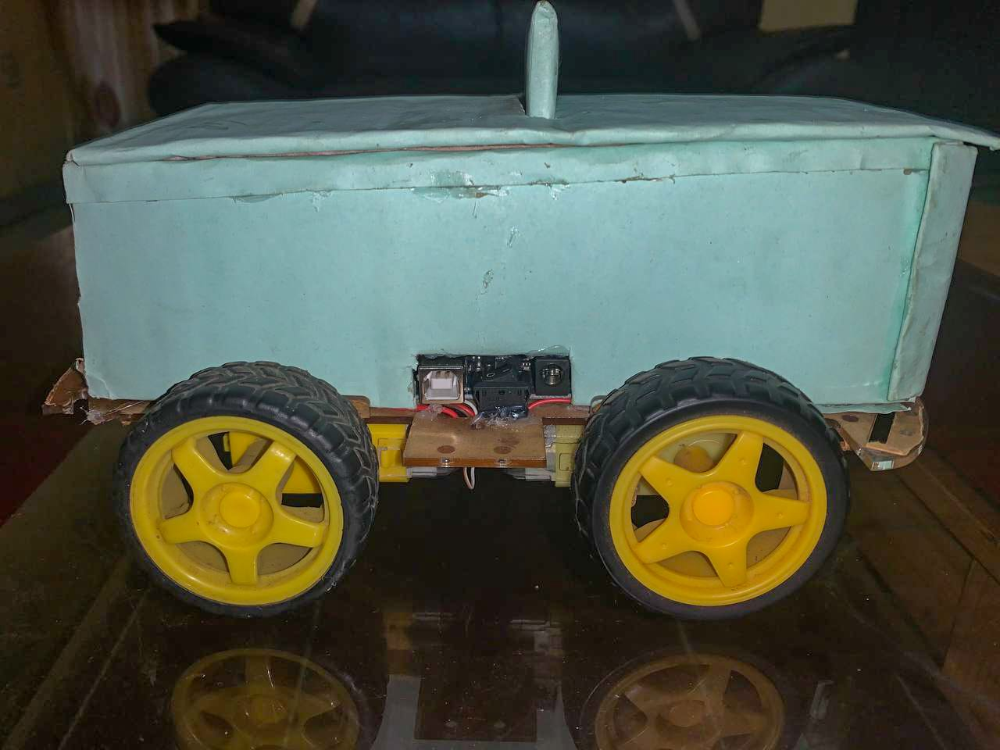

# Obstacle Avoiding Robot Car

> An autonomous robot car that detects obstacles using an ultrasonic 
> sensor and navigates around them automatically. Built with Arduino UNO, 
> L298N motor driver, and programmed in C++ using Arduino IDE.



## Overview
This project is a fully functional autonomous robot car that continuously 
monitors its environment using an HC-SR04 ultrasonic sensor. When an obstacle 
is detected within 50cm, the car stops, reverses, turns right and scans again 
— repeating until a clear route is found.

The entire logic is programmed in C++ on an Arduino UNO using the Arduino IDE. 
This was one of my first complete embedded systems projects involving both 
hardware assembly and software programming.

## Parts Used
| Component | Description |
|---|---|
| Arduino UNO | Main microcontroller (ATmega328) |
| L298N Motor Driver | Controls speed and direction of DC motors |
| HC-SR04 Ultrasonic Sensor | Detects obstacles by measuring distance |
| DC Motors (×4) | Two left + two right, 5V each |
| Li-ion Battery (×3) | 3.7V 3000mAh cells in series = 11.1V |
| Robot Chassis | Carries all components |

## How It Works
Car Switched ON
↓
Sense distance with ultrasonic sensor
↓
Obstacle within 50cm?
YES → Stop → Move backward → Turn Right → Sense again
→ Obstacle within 20cm? YES → Turn Right again
NO  → Keep moving straight

## Arduino Code

```cpp
// Motor A
int enA = 10;
int in1 = 7;
int in2 = 6;
// Motor B
int enB = 11;
int in3 = 5;
int in4 = 4;
// Ultrasonic sensor
int trig = 3;
int echo = 2;
int read_d;
float D;
float distance;
int speed1 = 150;
int speed2 = 0;
int speed3 = 50;
int check;

void setup() {
  pinMode(enA, OUTPUT);
  pinMode(enB, OUTPUT);
  pinMode(in1, OUTPUT);
  pinMode(in2, OUTPUT);
  pinMode(in3, OUTPUT);
  pinMode(in4, OUTPUT);
  Serial.begin(9600);
  pinMode(trig, OUTPUT);
  pinMode(echo, INPUT);
}

void loop() {
  distance = sense();
  delay(10);
  check = checkObstacle(distance);
  if (check == 1) {
    delay(10);
    obstacleMove();
    check = checkObstacle2(distance);
  } else {
    moveStraight();
  }
  delay(100);
}

void moveStraight() {
  analogWrite(enA, speed1);
  analogWrite(enB, speed1);
  digitalWrite(in1, LOW);
  digitalWrite(in2, HIGH);
  digitalWrite(in3, LOW);
  digitalWrite(in4, HIGH);
}

void moveRight() {
  analogWrite(enA, speed3);
  analogWrite(enB, speed1);
  digitalWrite(in1, LOW);
  digitalWrite(in2, HIGH);
  digitalWrite(in3, HIGH);
  digitalWrite(in4, LOW);
  delay(25);
}

int checkObstacle(float distance) {
  if (distance < 50) return 1;
  else return 0;
}

int checkObstacle2(float distance) {
  if (distance < 20) return 1;
  else return 0;
}

void obstacleMove() {
  // Stop
  digitalWrite(in1, LOW); digitalWrite(in2, LOW);
  digitalWrite(in3, LOW); digitalWrite(in4, LOW);
  delay(1000);
  // Move backward
  digitalWrite(in1, HIGH); digitalWrite(in2, LOW);
  digitalWrite(in3, HIGH); digitalWrite(in4, LOW);
  delay(300);
  // Stop again
  digitalWrite(in1, LOW); digitalWrite(in2, LOW);
  digitalWrite(in3, LOW); digitalWrite(in4, LOW);
  delay(1000);
  // Turn right
  moveRight();
  delay(300);
}

float sense() {
  float dist;
  digitalWrite(trig, LOW);
  delayMicroseconds(2);
  digitalWrite(trig, HIGH);
  delayMicroseconds(10);
  digitalWrite(trig, LOW);
  read_d = pulseIn(echo, HIGH);
  dist = read_d * 0.034 / 2;
  Serial.print("distance = ");
  Serial.print(distance);
  Serial.println("cm");
  return dist;
}
```

## Testing Results
- Car successfully detected obstacles at ~50cm and stopped
- Reversed and turned ~90° right to find a clear route
- If the new route had an obstacle within 20cm, it repeated the turn
- Car continued moving until next obstacle was detected
- Observation: sensor only detects directly ahead — future improvement 
  would be adding side sensors or a wider-range sensor

## Images & Videos



## Demo Videos
> Videos of the robot car during testing are available — see the `videos/` 
> folder or check the links below.

## What I Learned
- Arduino UNO programming in C++ using Arduino IDE
- Ultrasonic sensor (HC-SR04) interfacing for real-time distance measurement
- L298N motor driver wiring and PWM speed control
- Series battery pack assembly for powering motors and microcontroller
- Autonomous decision logic — stop, reverse, turn, re-sense
- Debugging embedded systems through serial monitor output

## Tools & Technologies
- Arduino IDE (C/C++)
- Arduino UNO (ATmega328)
- L298N Motor Driver
- HC-SR04 Ultrasonic Sensor
